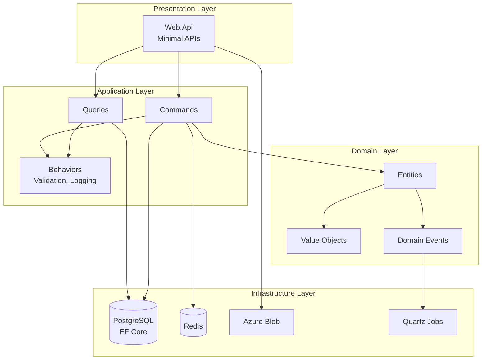
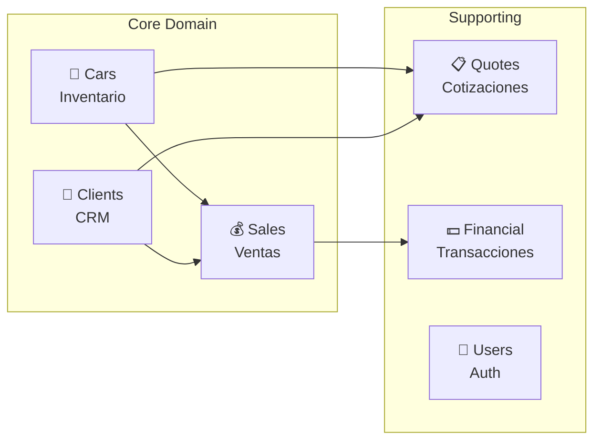
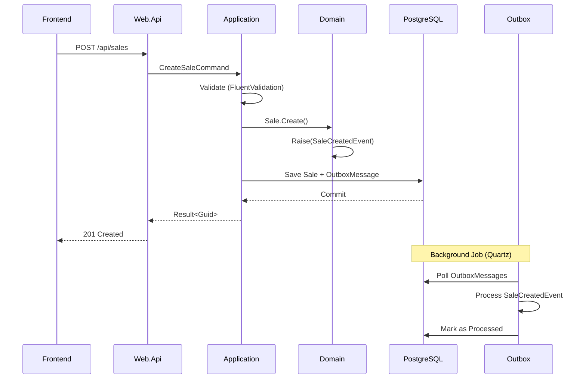

# CarStore Backend - Arquitectura y Patrones

## Visión General

CarStore Backend es una API REST construida con **.NET 8** siguiendo **Clean Architecture** y **DDD**. Gestiona el ciclo de vida completo de una concesionaria: inventario, clientes, ventas, cotizaciones y finanzas.

---

## Arquitectura de Capas



---

## Stack Tecnológico

| Categoría | Tecnología | Uso |
|-----------|------------|-----|
| **Runtime** | .NET 8 | Framework principal |
| **ORM** | EF Core 8 | Acceso a datos |
| **Database** | PostgreSQL 17 | Persistencia |
| **Cache** | Redis 7 | Caché distribuido |
| **Mediator** | MediatR 12 | CQRS pattern |
| **Validation** | FluentValidation | Validación de comandos |
| **Jobs** | Quartz.NET | Background jobs (Outbox) |
| **Observability** | OpenTelemetry | Traces, Logs, Metrics |
| **Logging** | Serilog + Seq | Structured logging |
| **Storage** | Azure Blob | Imágenes de vehículos |

---

## Bounded Contexts



| Context | Responsabilidad | Aggregate Root |
|---------|-----------------|----------------|
| **Cars** | Gestión de inventario de vehículos | `Car` |
| **Clients** | CRM y gestión de clientes | `Client` |
| **Sales** | Proceso de venta | `Sale` |
| **Quotes** | Cotizaciones a clientes | `Quote` |
| **Financial** | Transacciones y caja | `Transaction` |
| **Users** | Autenticación y autorización | `User` |

---

## Flujo de una Venta



---

## CQRS Implementation

### Commands (Write)

```
POST   /api/cars          → CreateCarCommand
PUT    /api/cars/{id}     → UpdateCarCommand
DELETE /api/cars/{id}     → DeleteCarCommand
POST   /api/sales         → CreateSaleCommand
POST   /api/sales/{id}/complete → CompleteSaleCommand
```

### Queries (Read)

```
GET /api/cars             → ListCarsQuery
GET /api/cars/{id}        → GetCarByIdQuery
GET /api/clients          → ListClientsQuery
GET /api/sales/dashboard  → GetSalesDashboardQuery
```

---

## Patrones Implementados

| Patrón | Implementación | Ubicación |
|--------|----------------|-----------|
| **CQRS** | Commands/Queries separados | `Application/*/Commands`, `Queries` |
| **Mediator** | MediatR pipelines | `Application/Abstractions` |
| **Repository** | Interfaces en Domain | `Infrastructure/Repositories` |
| **Unit of Work** | EF Core DbContext | `Infrastructure/Database` |
| **Outbox Pattern** | Eventos persistidos | `ProcessOutboxMessagesJob` |
| **Domain Events** | Eventos en aggregates | `Domain/*/Events` |
| **Result Pattern** | Sin excepciones | `SharedKernel/Result.cs` |
| **Value Objects** | Tipos inmutables | `Domain/Shared/ValueObjects` |

---

## Infraestructura Implementada

### Health Checks

```
GET /health       → Liveness (app running)
GET /health/ready → Readiness (DB + Redis + custom)
```

### OpenTelemetry

- **Traces**: HTTP requests, DB queries
- **Metrics**: Request count, latency
- **Logs**: Structured via Serilog

### Caching Strategy

```csharp
// Redis para datos frecuentes
await _cache.GetOrSetAsync($"car:{id}", () => GetFromDb(id));
```

---

## Seguridad

| Mecanismo | Implementación |
|-----------|----------------|
| **Authentication** | JWT Bearer tokens |
| **Authorization** | Policy-based + Claims |
| **Password Hashing** | BCrypt |
| **Token Refresh** | Refresh tokens en DB |

---

## Estructura de Carpetas

```
src/
├── Domain/                 # Núcleo - cero dependencias
│   ├── Cars/              
│   ├── Clients/           
│   ├── Sales/             
│   ├── Financial/         
│   ├── Quotes/            
│   └── Shared/            # Value Objects comunes
│
├── Application/            # Casos de uso
│   ├── */Commands/        
│   ├── */Queries/         
│   └── Abstractions/      # Interfaces
│
├── Infrastructure/         # Implementaciones
│   ├── Database/          # EF Core
│   ├── Caching/           # Redis
│   ├── Authentication/    # JWT
│   └── BackgroundJobs/    # Quartz
│
└── Web.Api/                # HTTP layer
    ├── Endpoints/         
    └── Middleware/        
```
