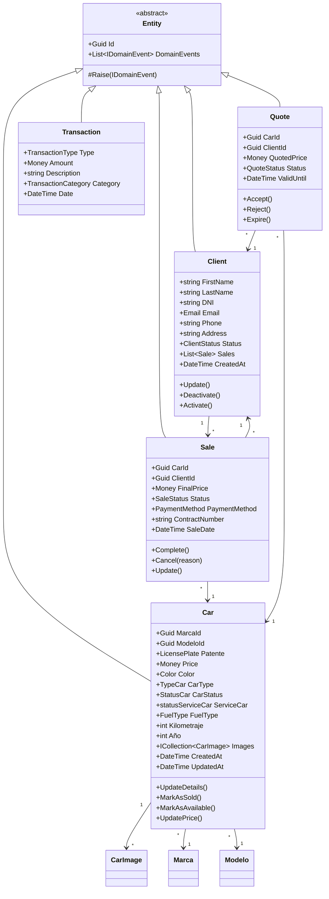
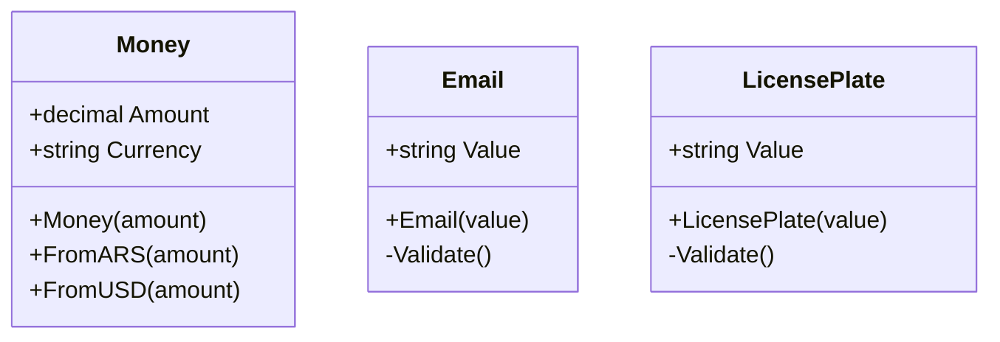
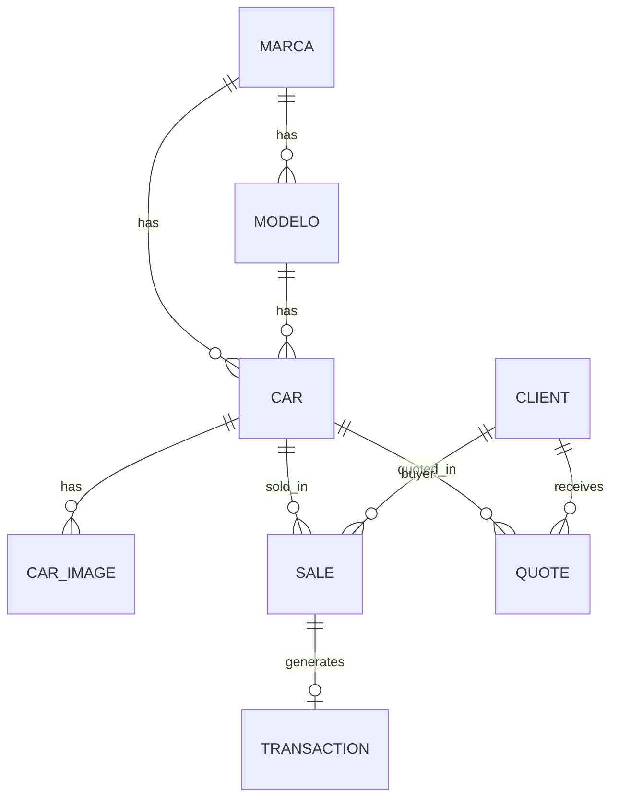

# CarStore - Modelo de Dominio

## Diagrama de Clases

---

## Aggregates

### 🚗 Car Aggregate

| Propiedad | Tipo | Descripción |
|-----------|------|-------------|
| `Patente` | `LicensePlate` (VO) | Identificador único del vehículo |
| `Price` | `Money` (VO) | Precio de venta |
| `Marca` | `Marca` (Entity) | Marca del vehículo |
| `Modelo` | `Modelo` (Entity) | Modelo del vehículo |
| `CarStatus` | `Enum` | Nuevo, Usado |
| `ServiceCar` | `Enum` | Disponible, Reservado, Vendido, En Servicio |
| `Images` | `Collection` | Fotos del vehículo |

**Comportamientos:**

- `MarkAsSold()` → Cambia estado + emite `CarSoldDomainEvent`
- `UpdatePrice(money)` → Actualiza precio
- `UpdateDetails(...)` → Actualiza datos generales

---

### 👤 Client Aggregate

| Propiedad | Tipo | Descripción |
|-----------|------|-------------|
| `FirstName`, `LastName` | `string` | Nombre completo |
| `DNI` | `string` | Documento de identidad |
| `Email` | `Email` (VO) | Correo con validación |
| `Phone`, `Address` | `string` | Contacto |
| `Status` | `Enum` | Active, Inactive |
| `Sales` | `Collection` | Historial de compras |

**Comportamientos:**

- `Deactivate()` → Marca como inactivo + emite `ClientDeactivatedDomainEvent`
- `Update(...)` → Actualiza datos de contacto

---

### 💰 Sale Aggregate

| Propiedad | Tipo | Descripción |
|-----------|------|-------------|
| `CarId` | `Guid` | Vehículo vendido |
| `ClientId` | `Guid` | Comprador |
| `FinalPrice` | `Money` (VO) | Precio final negociado |
| `Status` | `Enum` | Pending, Completed, Cancelled |
| `PaymentMethod` | `Enum` | Cash, Transfer, Financing |

**Comportamientos:**

- `Complete()` → Finaliza venta + emite `SaleCompletedDomainEvent`
- `Cancel(reason)` → Cancela + emite `SaleCancelledDomainEvent`

**Invariantes:**

- Solo ventas `Pending` pueden completarse o cancelarse
- La razón de cancelación es obligatoria

---

## Value Objects

| Value Object | Validación | Uso |
|--------------|------------|-----|
| `Money` | Amount >= 0 | Precios, transacciones |
| `Email` | Formato válido | Contacto de clientes |
| `LicensePlate` | 6+ caracteres | Patente de vehículos |

---

## Enums

### Cars

| Enum | Valores |
|------|---------|
| `TypeCar` | Sedan, Hatchback, SUV, Pickup, Van |
| `StatusCar` | New, Used |
| `statusServiceCar` | Disponible, Reservado, EnServicio, Vendido |
| `FuelType` | Nafta, Diesel, GNC, Electrico, Hibrido |
| `Color` | Blanco, Negro, Gris, Rojo, Azul, ... |

### Sales

| Enum | Valores |
|------|---------|
| `SaleStatus` | Pending, Completed, Cancelled |
| `PaymentMethod` | Cash, Transfer, Check, Financing |

### Clients

| Enum | Valores |
|------|---------|
| `ClientStatus` | Active, Inactive |

---

## Domain Events

| Event | Trigger | Handlers |
|-------|---------|----------|
| `NewCarDomainEvent` | Car created | Log, Notify |
| `CarSoldDomainEvent` | Car.MarkAsSold() | Update inventory |
| `ClientCreatedDomainEvent` | Client created | Welcome email |
| `ClientDeactivatedDomainEvent` | Client.Deactivate() | Audit log |
| `SaleCreatedDomainEvent` | Sale created | Start workflow |
| `SaleCompletedDomainEvent` | Sale.Complete() | Mark car as sold, Create transaction |
| `SaleCancelledDomainEvent` | Sale.Cancel() | Release car |

---

## Relaciones entre Aggregates

