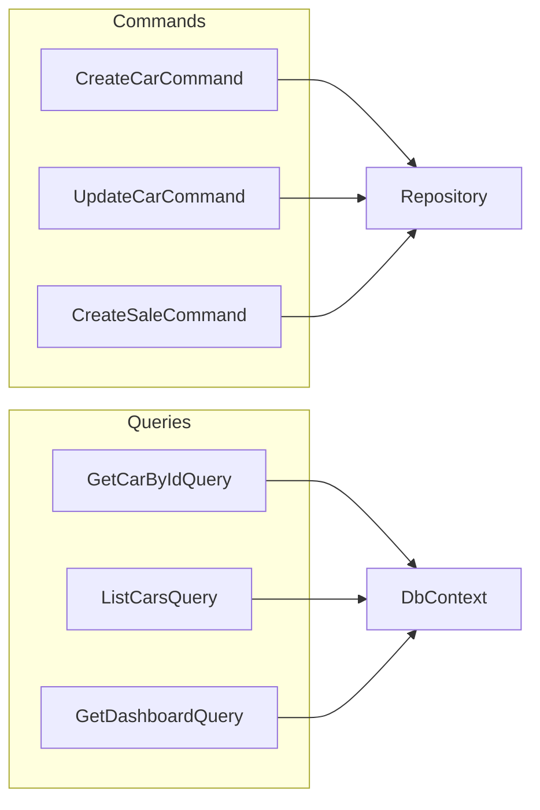
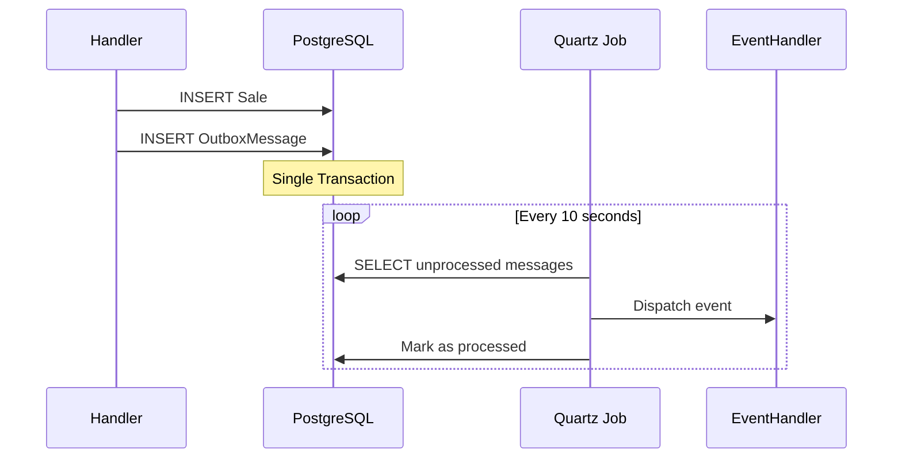
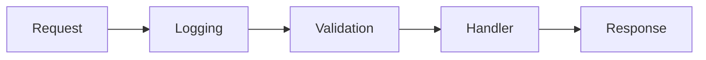

# CarStore - Patrones y Prácticas Implementadas

## Patrones de Diseño

### 1. CQRS (Command Query Responsibility Segregation)

Separación clara entre operaciones de escritura (Commands) y lectura (Queries).



**Implementación:**

```csharp
// Command → Modifica estado
public record CreateCarCommand(...) : IRequest<Result<Guid>>;

// Query → Solo lectura
public record GetCarByIdQuery(Guid Id) : IRequest<Result<CarResponse>>;
```

---

### 2. Outbox Pattern

Garantiza consistencia entre base de datos y eventos.



**Ubicación:** `Infrastructure/BackgroundJobs/ProcessOutboxMessagesJob.cs`

---

### 3. Domain Events

Eventos levantados por aggregates para comunicar cambios.

| Aggregate | Evento | Cuándo |
|-----------|--------|--------|
| `Car` | `NewCarDomainEvent` | Al crear |
| `Car` | `CarSoldDomainEvent` | Al marcar vendido |
| `Sale` | `SaleCreatedDomainEvent` | Al crear venta |
| `Sale` | `SaleCompletedDomainEvent` | Al completar |
| `Client` | `ClientCreatedDomainEvent` | Al registrar |

**Implementación:**

```csharp
// En Entity base
protected void Raise(IDomainEvent domainEvent) 
    => _domainEvents.Add(domainEvent);

// En SaveChanges, los eventos se persisten al Outbox
```

---

### 4. Repository Pattern

Abstracción sobre persistencia, definido en Domain, implementado en Infrastructure.

```csharp
// Domain/Abstractions
public interface ICarRepository
{
    Task<Car?> GetByIdAsync(Guid id, CancellationToken ct);
    void Add(Car car);
    void Update(Car car);
    void Remove(Car car);
}

// Infrastructure/Repositories
internal sealed class CarRepository : ICarRepository { ... }
```

---

### 5. Result Pattern

Sin excepciones para flujo de control. Errores explícitos.

```csharp
public async Task<Result<Guid>> Handle(CreateCarCommand request, CancellationToken ct)
{
    var existing = await _repository.GetByPatenteAsync(request.Patente, ct);
    if (existing is not null)
        return Result.Failure<Guid>(CarErrors.AlreadyExists);
    
    var car = new Car(...);
    _repository.Add(car);
    await _unitOfWork.SaveChangesAsync(ct);
    
    return car.Id;
}
```

---

### 6. Value Objects

Tipos inmutables que encapsulan validación.

```csharp
public sealed record Money(decimal Amount, string Currency = "ARS")
{
    public Money(decimal amount) : this(amount, "ARS") { }
}

public sealed record Email
{
    public string Value { get; }
    
    public Email(string value)
    {
        if (!IsValid(value))
            throw new DomainException("Email inválido");
        Value = value;
    }
}
```

---

### 7. MediatR Pipeline Behaviors

Comportamientos transversales aplicados a todos los requests.



| Behavior | Propósito |
|----------|-----------|
| `LoggingBehavior` | Log de entrada/salida |
| `ValidationBehavior` | FluentValidation |

---

## Principios SOLID

| Principio | Aplicación |
|-----------|------------|
| **S**ingle Responsibility | Una clase = una razón para cambiar |
| **O**pen/Closed | Extensible via herencia, cerrado a modificación |
| **L**iskov Substitution | Interfaces bien definidas |
| **I**nterface Segregation | Interfaces pequeñas y específicas |
| **D**ependency Inversion | Depender de abstracciones |

---

## Infraestructura Transversal

### OpenTelemetry

```csharp
// Traces, Metrics, Logs configurados en DependencyInjection
services.AddOpenTelemetry()
    .WithTracing(...)
    .WithMetrics(...)
    .WithLogging(...);
```

### Health Checks

```csharp
services.AddHealthChecks()
    .AddNpgSql(...)
    .AddRedis(...)
    .AddCheck<CustomHealthCheck>(...);
```

### Caching (Redis)

```csharp
// Patrón Cache-Aside
var cached = await _cache.GetAsync<CarResponse>(key);
if (cached is not null) return cached;

var data = await _repository.GetByIdAsync(id);
await _cache.SetAsync(key, data, TimeSpan.FromMinutes(5));
return data;
```
